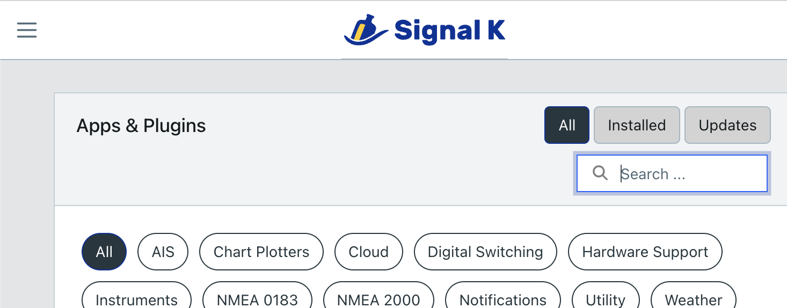
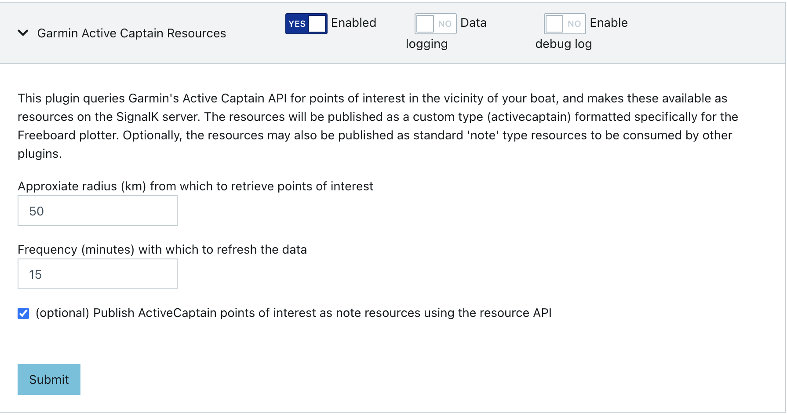
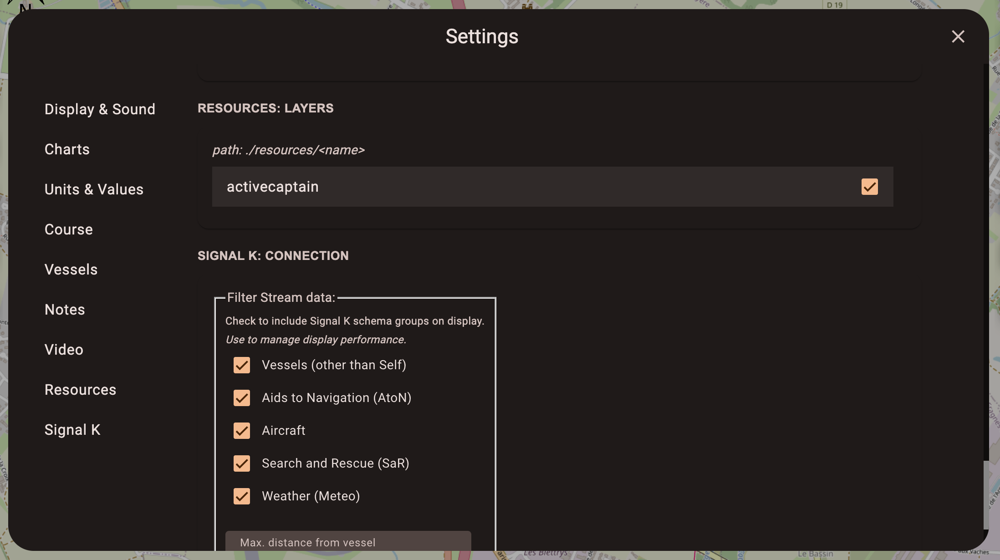
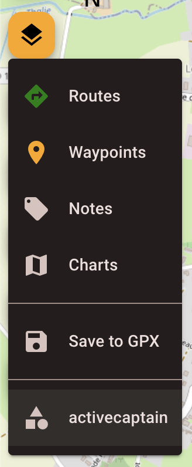
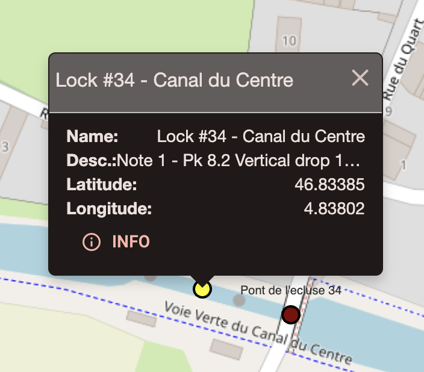

<h3 align="center">SignalK Active Captain Resources</h3>

<div align="center">

[](https://github.com/KvotheBloodless/signalk-activecaptain-resources/releases)
[](https://github.com/KvotheBloodless/signalk-activecaptain-resources/issues)
[](https://github.com/KvotheBloodless/signalk-activecaptain-resources/pulls)
[](https://github.com/KvotheBloodless/signalk-activecaptain-resources?tab=MIT-1-ov-file#readme)

</div>

---

<p align="center">A plugin for the node.js <a href="https://github.com/SignalK/signalk-server">Signal K server</a> for boats to import points of interest from the <a href = "https://marine.garmin.com/thirdparty-stage/swagger/index.html">Garmin Active Captain API</a> and make these available as resources.
    <br> 
</p>

## 📝 Table of Contents

- [About](#about)
- [Getting Started](#getting_started)
- [Usage](#usage)
- [Notes](#notes)
- [Authors](#authors)
- [Acknowledgments](#acknowledgement)

## 🧐 About <a name = "about"></a>

 * Garmin's ActiveCaptain brings together the large boating community enabling sharing of information making boating safer, less expensive and more enjoyable.

 * Signal K is an open source server application that runs as a central information hub on a boat. It centralises data, provides a rich API to consume the data, and is extensible through a comprehensive suite of plugins (such as this one) and web applications.

 * Freeboard is a powerful chart plotter web application that runs as a webapp on the Signal K server.

This plugin's purpose is to bring together these 3 components by making information from the ActiveCaptain API available as resources throught the Signal K server which can then be consumed and displayed by Freeboard as an extra layer of information on the chart.

## 🏁 Getting Started <a name = "getting_started"></a>

These instructions will get you up and running.

### Prerequisites

 * A running instance of the Signal K node server with a position source (a GPS).

Instructions [here](https://github.com/SignalK/signalk-server/blob/master/README.md)

### Installing this plugin

Through the Signal K server Appstore, search for signalk-activecaptain-resources, and click the Install button.



### Configuration

In the Signal K menu, head to Server -> Plugin Config, and find Garmin Active Captain Resources then enable the plugin. Default values are fine for now, so just click Submit.



## 🎈 Usage <a name="usage"></a>

In the Signal K menu, head to Webapps and launch Freeboard-SK. In the Freeboard settings, navigate to Resources, and check the box next to "activecaptain".



Next, click the layers button, select activecaptain, and 



Finally, select the point of interest categories you would like to see displayed on the chart, and you will see coloured dots for the active captain data appear.




## Notes <a name = "notes"></a>

 This plugin uses the built-in resources feature of the Signal K server and the data gathered from ActiveCaptain is available to be consumed using the resources API. The resources published under the custom type 'activecaptain' are specifically intended for consumption by Freeboard, but by enabling the "notes" feature in the plugin configuration, data may also be consumed as standard 'note' type resources by other plugins/webapplications using the API.

 ```
 > curl -XGET "localhost:3000/signalk/v2/api/resources/notes/562951" | jq
{
  "name": "Pont de Fontaines (amont)",
  "description": "Note 1 - Above and below bridge, bollards on right bank. Rubbish bins and tables.\n",
  "position": {
    "latitude": 46.85870176208298,
    "longitude": 4.797202907502652
  },
  "group": "Anchorage",
  "url": "https://activecaptain.garmin.com/en-US/pois/562951"
}
 ```

## ✍️ Authors <a name = "authors"></a>

- [@KvotheBloodless](https://github.com/KvotheBloodless) - Idea & Initial work
<a href="https://www.buymeacoffee.com/KvotheBloodless" target="_blank"></a>

See also the list of [contributors](https://github.com/KvotheBloodless/signalk-activecaptain-resources/graphs/contributors) who participated in this project.
